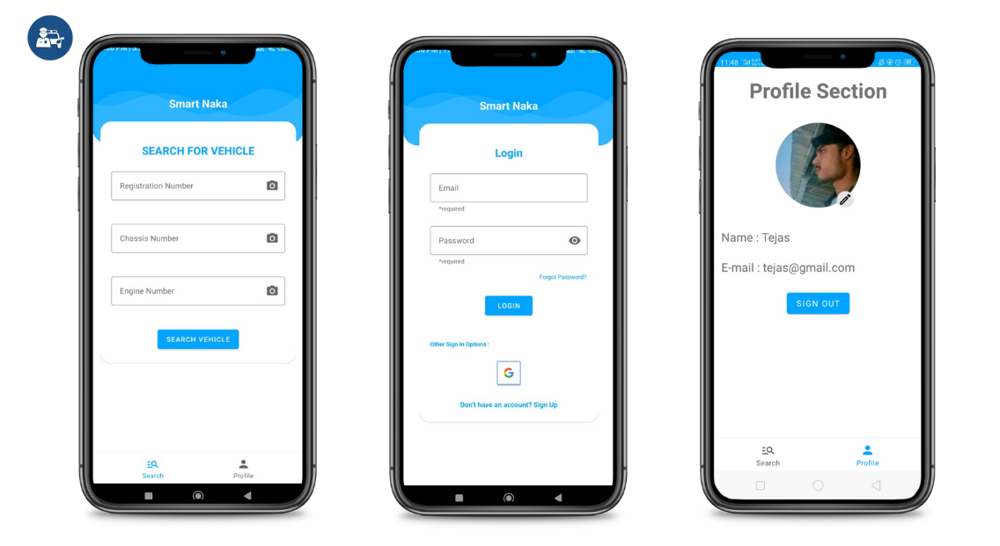

# Smart Naka
This is an Android Native application which is developed as a solution for _**ETHOS IIT-G**_ for the problem statement Smart Naka by Assam Police. The detailed problem statement and proposed solution are mentioned furthur in the document.

Click [here](https://youtu.be/abfQfUm2WHo) for the video presentation with app demo.
## Problem Statement:
There is a database of stolen vehicles in the Vaahan portal maintained by the Ministry of Road Transport and Highways, Government of India. We need to create a mobile app integrating with Vaahan portal through API so that a constable executing naka at the road can check the details of a suspicious vehicle in his mobile at real time.
The traditional method of Naka is quite slow, because the constable has to manually take all the inputs mostly in pen-paper mode, & then get it checked from the police station.
## Proposed Solution:
We intend to solve these problems by giving an interface to access the database in the form of an Android application. We are using ANPR(Automatic Number Plate Recognition) technique through which we target to provide the constable a very low querying time through their mobile phones. 

## Screenshots of the application



## How does it work?
It is a Android Native application built using Kotlin and also using XML for layouts. It uses Python for Number plate recognition which was integrated within the application using some chaquopy library. We assumed the data to be nosql as the searches are usually faster than SQL data. 
Our app helps to reduce the time for identification of stolen vehicles, by allowing the constable to check the details of a suspicious vehicle in his mobile at real time. The constable can either enter the details of the vehicle manually or can take the picture of the number plate or engine number or chassis number, the anpr(automatic number Plate recognition) integrated with the app recognises the number from the clicked photo, which makes the whole process simple and faster. After that, the searching can be done by just a single click. The image recognition part takes around 800-900ms, & the database querying part takes around 200-400ms.

## Use this application : 

1. You can download the [APK](https://drive.google.com/file/d/1vHX2aQi_gJ_KtgtkkCXrWn2BKt-gG0_p/view?usp=share_link), and then install it (you might have to enable installation from unknown sources).

2. Or you can clone the repository and import in Android Studio to see the code + build the APK.

```bash
git clone https://github.com/akshatkverma/Smart-Naka.git
```
# Team Details :
**Team Name** : Lifetime Error

**Team Members**:
1. [Akshat Kumar Verma](https://www.linkedin.com/in/akshatkumarverma/)
2. [Mayur Ray](https://www.linkedin.com/in/raymayur9/)
3. [Tejas](https://www.linkedin.com/in/tejashwadeep-jha-77885a230)
4. [Govind Singh](https://www.linkedin.com/in/govind-singh-161bb0153/)